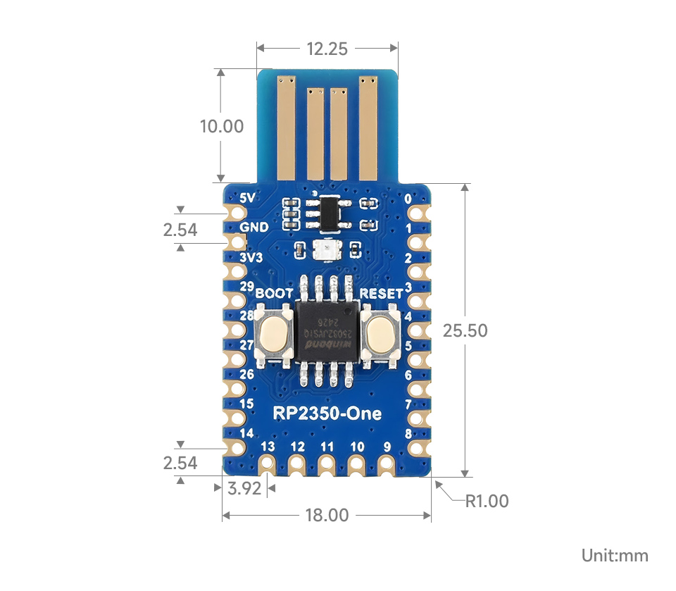

**TLDR** For just 60 RMB, get an RP2350 development board, flash it with the PicoKey firmware, and you can create your own open-source hardware security key to use as a budget YubiKey. It supports FIDO2 login and OpenPGP, but the hardware login and encryption functions cannot be used simultaneously. The steps are simple: buy the board → download the firmware → hold the BOOT button while plugging it into your computer to flash the firmware → initialize via the web config page → done. Perfect for cheapskates (like me) who don’t want to spend hundreds on a YubiKey but still want to play with hardware keys.

<!--more-->

Open-source hardware personal keys are pretty great. For about 60 RMB, you can solve a lot of problems.  
For me, the biggest hope was to achieve quick login to my work computer—that alone would’ve been awesome. (After all, company passwords have to be changed every three months and must meet certain complexity requirements, which makes them really hard to remember…)  
But it turned out I couldn’t use it… The company’s IT department sternly rejected my simple request. So frustrating…

Also, at work, it’d be nice to use private windows to log into personal sites without relying on my personal password manager. This would help keep my information separate from the company environment, which is something I care a lot about in terms of personal privacy.  
Plus, it fits well with my “always ready to leave” work style. 😂

There aren’t many hardware key options out there, and even fewer open-source ones that are actually good. The main ones are:
- Domestically produced [CanoKey](https://docs.canokeys.org/),
- Google’s [OpenSK](https://github.com/google/OpenSK),
- The one I chose: [Pico Key](https://www.picokeys.com/),
- The original [Yubico YubiKey](https://www.yubico.com/),
- Others like [Onlykey](https://onlykey.io/), [Solokey](https://solokeys.com/), [Nitrokey](https://www.nitrokey.com/), [thetis](https://thetis.io/).

When making my choice, I first referred to the [security key criteria](https://www.privacyguides.org/en/security-keys/#criteria) from [Privacy Guides](https://www.privacyguides.org/).  
I wanted to meet the standard with the least amount of money, and also considered popular recommendations.

CanoKey gave me the impression that they’ve shifted toward selling physical keys directly, and their maintenance of the open-source part is quite rough—especially since there are still many security issues with the open-source version. A CanoKey costs about 179 RMB, and since I wanted to spend as little as possible, I passed on this option.  
OpenSK seems to update slowly. After 2021, it’s been entirely maintained by the community, with no fixed versions provided—you have to build the latest code yourself using `cargo build`. Even though I work with Rust, building it myself is still a hassle…  
Yubico? Just expensive. Ranging from 300 RMB to over a thousand. I didn’t feel like spending that much right now—keeping it cheap is priority number one.  
Onlykey and others are also pretty pricey… In the end, I chose PicoKeys because it’s simple, cheap, easy to maintain, and has decent functionality. It meets almost all my requirements, but the downside is that PicoKey can’t handle both hardware login and OpenPGP encryption at the same time.

### Making Process

I followed the [official instructions](https://www.picokeys.com/pico-fido/) along with tutorials from Muse Da Lao (see [L station post](https://linux.do/t/topic/485658) and [MUSE Blog](https://blog.pepaper.org/2025/03/%e8%87%aa%e5%88%b6%e5%85%bc%e5%ae%b9-yubikey-%e7%9a%84-fido2-%e7%a1%ac%e4%bb%b6%e5%ae%89%e5%85%a8%e5%af%86%e9%92%a5/)).  

If you need a quick start guide, Muse’s tutorial is more concise and clear. My process here will include some of my own installation notes and how to use it afterward. Mostly to help myself remember and organize.

#### Step 1 - Basic Preparation

I bought the Waveshare RP2350-One development board. It’s priced around 28–30 RMB on Taobao—a very 良心 (conscience-friendly) price!

Some accessories to improve the user experience: a 3D-printed case or heat shrink tubing.


Note: Do not choose the older RP2040 development board. PicoKey [officially recommends using RP2350](https://github.com/polhenarejos/pico-fido?tab=readme-ov-file#security-considerations) because it offers better security, significantly reducing key usage risks and ensuring safety and reliability.



Waveshare RP2350-One dimensions:

So theoretically, you should buy heat shrink tubing with an 18mm diameter. 2 meters cost about 5–7 RMB. If you don’t have a heat gun, you’ll need to buy one—usually around 50–100 RMB.



There are several open-source case designs available. The main ones I found are:
- [@PatvdLeer](https://www.printables.com/@PatvdLeer)’s [3D-printed case](https://www.printables.com/model/1129764-waveshare-rp2040-one-and-rp2350-one-case)
- [@taoengine](https://makerworld.com.cn/zh/@taoengine)’s [case](https://makerworld.com.cn/zh/models/1514456-rp2350-rp2040-one-usbbao-hu-ke-yong-yu-pico-keys)
- [@wtser](https://makerworld.com.cn/zh/@wtser)’s optimized [case](https://makerworld.com.cn/zh/models/1576841-waveshare-rp2350-one-usb-wai-ke#profileId-1722358)

Choose one you like and find a 3D printing shop to print it. I found mine on Taobao.


#### Step 2 - Download Firmware

The official website offers three firmware types:
1. Pico HSM
2. Pico Fido
3. Pico OpenPGP

They provide encryption/decryption and key functions. Pico OpenPGP offers encryption keys that comply with the OpenGPG standard.  
For my needs—just a hardware key—downloading Pico Fido alone is sufficient. If you also need cryptographic applications like digital authentication or encryption/decryption (e.g., signing git commits), you can add HSM and OpenPGP firmware.  
The basic installation process is the same.

You can follow the official [download guide](https://www.picokeys.com/getting-started/) to get the firmware,  
or directly download what you need from the official GitHub repositories ([HSM](https://github.com/polhenarejos/pico-hsm/releases), [Fido](https://github.com/polhenarejos/pico-fido/releases), [OpenPGP](https://github.com/polhenarejos/pico-openpgp/releases)).

In short, the official guide makes it easier to find the right hardware version.

If you bought the same Waveshare product as me, find “Waveshare” under Vendor and “RP2350-One” under Model, then click download.

However, one issue with PicoKey is that you can’t use all three firmware types simultaneously… So choose your usage needs, download the corresponding firmware,  
and if you’ve already installed one firmware and want to switch functions, you need to use the [data wipe firmware](https://github.com/polhenarejos/pico-nuke/releases) to clear existing data before flashing the new firmware.  
For a brand-new board, just flash your target firmware directly.


1. Choose your hardware key usage goal (HSM, Fido, OpenPGP)
2. Download the specified firmware
3. If switching functions (e.g., from Fido to OpenPGP), install the Pico Nuke firmware first
4. After hardware initialization or for new hardware, flash the target firmware
5. To install the firmware, just drag the corresponding `.uf2` file onto the development board


#### Step 3 - Installation

This section mainly documents how to flash the firmware onto the RP2350-One and complete the initial setup.  
As mentioned earlier, flashing the firmware involves dragging the firmware file onto the development board. This method is specific to the RP2350-One and may not apply to all development boards, though most RP2350 chip boards should be similar.

Detailed steps (i.e., firmware flash via recovery mode):

1. Disconnect the device
2. Hold the BOOTSEL button (BOOT button) while plugging the device into a USB port (you can release the BOOT button after insertion)
3. A mounted storage unit named RPI-RP2 (for RP2040 boards) or RP2350 (for RP2350 boards) will appear in your file explorer
4. Copy the downloaded `.uf2` file to this mounted unit
5. The device will automatically unmount the storage unit and remount as Pico Key. The LED will blink periodically

For the Waveshare RP2350-One development board, the BOOT button is clearly visible on the left, with RESET on the right.  
You can also refer to the dimension diagram earlier to locate the button.

Many tutorials recommend waiting one minute after dragging the firmware onto the storage, but through testing, I found that after dragging the firmware, the device automatically ejects and starts blinking red.  
Just wait until the red blinking turns into periodic blue blinking—the firmware is most likely flashed successfully.  
If you’re still unsure, check out this firmware flash example from Waveshare:



For more details, see Waveshare’s official [RP2350-One#Firmware Download](https://www.waveshare.net/wiki/RP2350-One#.E5.9B.BA.E4.BB.B6.E4.B8.8B.E8.BD.BD).


After flashing the firmware, it’s time to configure the Pico Key. Open the [Pico Keys configuration website](https://www.picokeys.com/pico-commissioner/).  
Although this configuration is web-based, all operations are performed locally—no data is uploaded to Pico Keys’ servers.

First, here’s the recommended configuration from Muse Da Lao:


- **Select a known vendor**: `Yubikey 4/5`
- **Options**: `LED dimmable` + `Secure Boot` + `Secure Lock` + `Power Cycle on Reset`
- **Product Name**: `Yubico YubiKey`
- **LED brightness**: `1`


This configuration is mainly for hardware keys. For OpenPGP, you can skip `Power Cycle on Reset`, and “Product Name” can be left blank.


- `Secure Boot` & `Secure Lock`: Mainly for security during network logins
- `Power Cycle on Reset`: Only effective for Pico Fido hardware keys
- **custom VID:PID**: Custom VID and PID in hexadecimal format, e.g., “1234:abcd”. Fill in as desired.
- **LED driver**: Two options: `Single` or `WS2812`. Choose based on your board. Waveshare’s board uses `Single`.


After filling in the configuration, press the `Commission via WebUSB` button to start initialization.  
On Windows, I used the Edge browser, which worked perfectly for key setup. Some recommend using Chrome on an Android phone, but I don’t think that’s necessary.  
When writing the settings in Edge on Windows (i.e., after pressing `Commission via WebUSB`), a confirmation box will pop up in the top left of the browser—select the Picokeys option.

Wait a moment. Once the key blinks blue and the brightness dims, initialization is complete. Then, unplug and replug the key. Basically, the key is now set up.  
On the key configuration page, select `Commission via WebAuthn` to verify the key. If you can add the key and simulate a login normally, then the login key is working.

Besides the [test website](https://webauthn.io/) provided by PicoKeys, you can also use others, like [Yubico’s test site](https://demo.yubico.com/webauthn-technical/registration).

#### Step 4 - Usage

In short: You can use it as a limited-functionality YubiKey.

On websites, as you might have experienced during testing, to use the key normally, you first need to register the key as a login key on the site.  
Then, during login, use the key for verification. However, note that when using key login, be sure to properly save the site’s recovery codes or recovery keys.  
Otherwise, you might lock yourself out of your own account…

For daily key management, you can use [YubiKey Manager](https://www.yubico.com/support/download/yubikey-manager/) or [YubiKey Personalization Tools](https://www.yubico.com/support/download/yubikey-personalization-tools/) for general management and editing.  
To manage TOTP, use [Yubico Authenticator](https://www.yubico.com/products/yubico-authenticator/).  
If you want to see more information or verify the installation like Muse Da Lao, install Yubico Authenticator.


1. Open “Settings → Accounts → Sign-in options”, select “Security key”, and open management.
2. Follow Windows’ prompts to complete key addition.
3. Note: To use the key, you need to press the BOOT button on the hardware key to initiate authentication.

It’s quite simple. For more detailed Windows usage instructions, refer to the [official guide](https://support.microsoft.com/zh-cn/topic/%E4%BD%BF%E7%94%A8%E5%AE%89%E5%85%A8%E5%AF%86%E9%92%A5%E7%99%BB%E5%BD%95%E5%88%B0%E5%B8%90%E6%88%B7-b23a2a45-6ab8-4c86-9f22-bcadf60235aa).


When using the key to log into a website, you need to initiate the site’s login verification, e.g., click “use passkey” or similar. Then press the BOOT button on the key.

#### Step 5 - OpenPGP

After installing and setting up with the Pico-OpenPGP firmware, you can add keys to this hardware card (OpenPGP smart card).  
But note: You need to first create GPG keys (including subkeys) and be familiar with GPG usage.


1. Confirm smart card info: `gpg --card-status`
2. Backup the keys to be migrated, including private keys, subkeys, and revocation keys: `gpg --armor --export-secret-key <KEYID> > private_keys.asc`
3. Use GPG commands to select subkeys and migrate them one by one to the smart card (simple example: `key1` → `keytocard`)
4. Delete migrated private keys
5. Confirm that only public keys remain locally

References:  
1. [GPG Usage Guide](https://blog.moe233.net/posts/18974f8b/)  
2. [GPG Physical Key from Installation to Use](https://blog.lamgc.moe/2021/02/26/gpg-smart-card-from-installation-to-use-tutorial/)  
3. [Smart Card Usage](https://tccmu.com/2024/08/12/openpgp/)


Once that’s done, the smart card is set up. The rest is just using it.  
Usage is super simple: After `gpg --edit-card`, enter `fetch` to auto-authenticate, then use as usual.

An even simpler way is to use [Kleopatra](https://docs.kde.org/stable5/en/kleopatra/kleopatra/index.html) to add and use the newly created smart card. If you installed Gpg4win on Windows, this software is already included.


- Admin PIN: 12345678
- PIN: 123456

Though it seems currently impossible to change the default PIN?


### Key Steps Summary


1. Buy suitable hardware
2. Download firmware
3. Flash firmware
4. Initialize hardware using web tool
5. Test and start using
